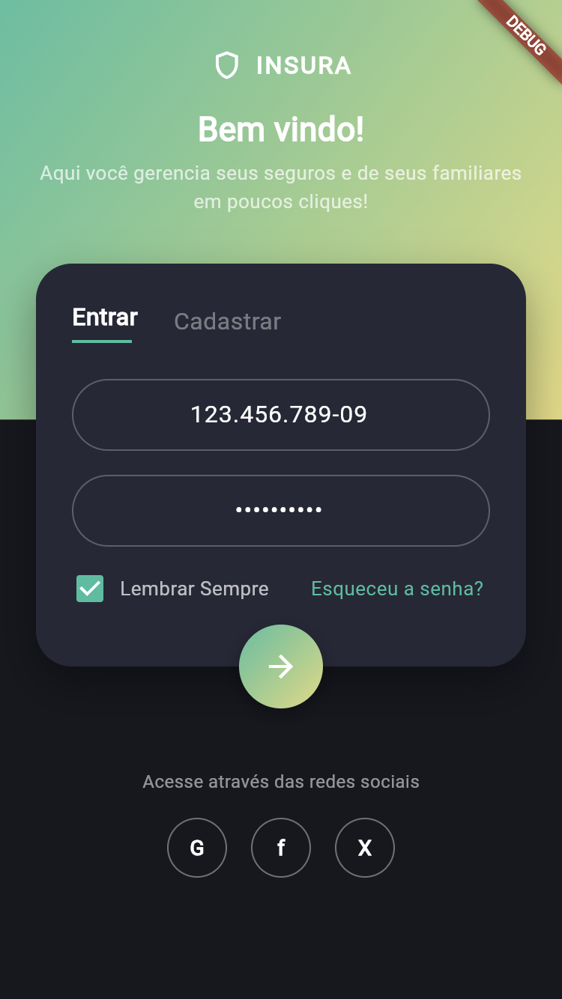
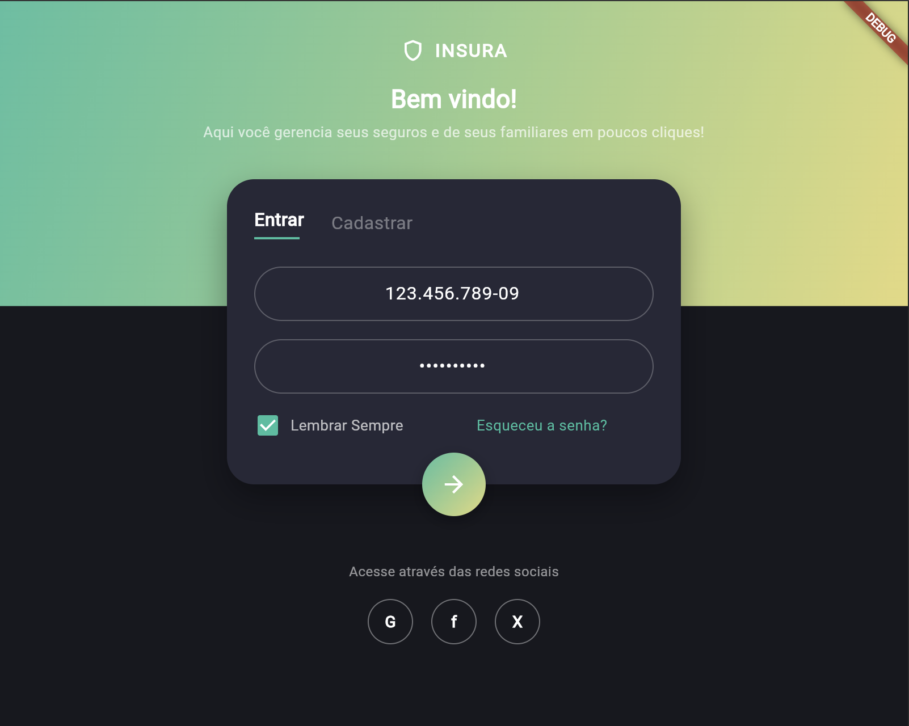
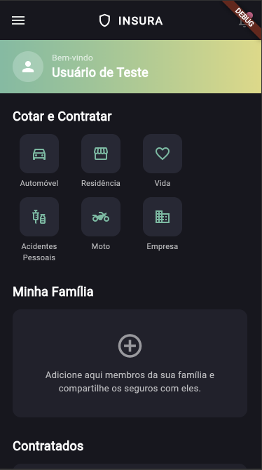
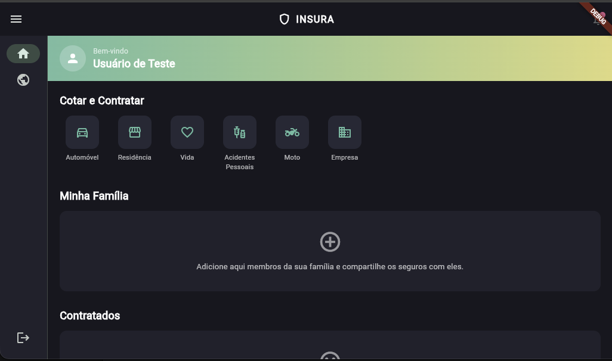
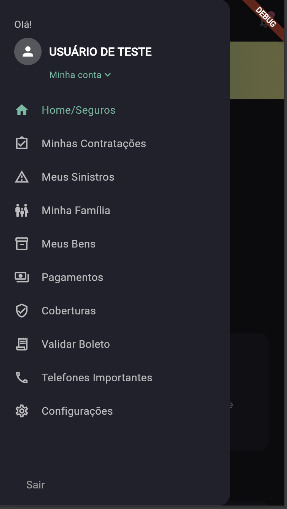
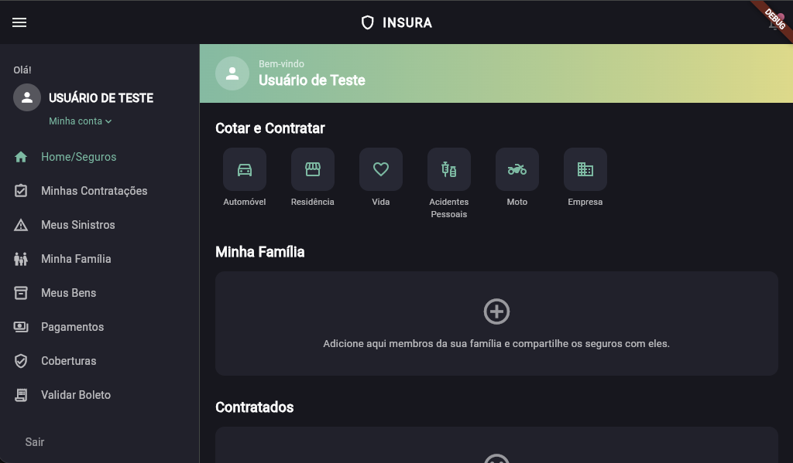

# Insura

Fictional insurance app built as a **personal study of Flutter and Artificial Intelligence**, focused on applying development best practices, code organization, and building an experience close to a real insurance app.

> 🚧 **Project in development**
>
> This project is being used as a lab for studying Flutter, architecture, state management, Firebase, and the use of AI throughout the development process.

## 📱 About the project

The app simulates the experience of an insurance app: authenticating by CPF, landing on a dashboard, and browsing insurance-related content through an embedded webview.

Currently, the project includes:

* Login by CPF + password (Firebase Authentication)
* "Remember me" (saved credentials, restored on next launch)
* Session-aware routing (auto-redirects to Login when signed out, and away from Login when already signed in)
* Home screen with a responsive navigation shell (side rail on desktop/web, drawer on mobile)
* Logout
* Generic WebView screen (deep-link/refresh-safe via query parameters)

New features and improvements will be added as the study evolves.

## 🖼️ Screenshots

### Login

| Mobile | Web |
| --- | --- |
|  |  |

### Home

| Mobile | Web |
| --- | --- |
|  |  |

### Menu

| Mobile | Web |
| --- | --- |
|  |  |

## 🏗️ Architecture

The project uses **MVVM (Model-View-ViewModel)** as its architectural reference, separating **View** (widgets in `presentation/pages` and `presentation/widgets`) from **ViewModel** (`presentation/cubit`), with the ViewModel exposing state to the View and containing no Flutter UI code.

**SOLID** principles are also applied, mainly to keep the data layer organized, decoupled, and easier to evolve and test.

### SOLID principles

How each principle is applied in Insura's Feature-First + MVVM + Cubit architecture:

* **S — Single Responsibility**: each layer has one job — `presentation/pages` only builds UI, `presentation/cubit` only manages state, `data/repositories` only decides how to fetch data and map failures, `data/datasources` only talks to one specific source (Firebase, secure storage, REST).
* **O — Open/Closed**: `Result<Failure, S>` and the sealed `LoginState`/`HomeState` classes are closed for contract changes but open for extension via new subclasses — adding a `Failure` type or a `LoginState` variant doesn't require touching existing callers. New features can be added under `features/` without modifying existing ones — the exception is the composition points (`app_router.dart`, `home_nav_destinations.dart`), which, being where features are wired together, require a small, targeted change to register the new feature.
* **L — Liskov Substitution**: any `AuthRemoteDataSource` implementation (`AuthRemoteDataSourceImpl`, backed by Firebase, or `AuthRemoteDataSourceFake`, used while there's no backend/for local dev) can substitute the abstraction without breaking `AuthRepository` or `LoginCubit`.
* **I — Interface Segregation**: repositories/datasources are segregated per concern (`AuthRepository` for auth, `AuthCredentialsStorage` for "remember me" persistence), so a class only depends on the methods it actually uses instead of one monolithic repository.
* **D — Dependency Inversion**: Cubits and repositories depend on abstractions (`abstract interface class`) injected via constructor through `get_it`, never on concrete implementations (`AuthRemoteDataSourceImpl`, `FirebaseAuth`) — this is what lets `AuthRemoteDataSourceFake` and Firebase test doubles (`firebase_auth_mocks`, `fake_cloud_firestore`) stand in for the real thing in dev/tests.

### State management

State management is handled using:

* **BLoC**
* **Cubit**

This choice separates state from the presentation layer, keeping widgets focused on building the interface and reacting to state via `BlocBuilder`/`BlocConsumer`.

### Routing

Navigation uses **go_router** (`MaterialApp.router`), configured in `lib/app/routes/app_router.dart`. A `redirect` callback backed by `AuthRepository.isLoggedIn`/`authStateChanges` guards every route: unauthenticated users are sent back to `/login`, and authenticated users are kept out of `/login`. Screens needing dynamic data (like `/webview`) read it from query parameters rather than route `extra`, so URLs stay deep-link/refresh-safe on web.

## 📂 Project structure

The project uses a **Feature-First** organization, separating the app's functionality into independent modules.

```text
lib/
├── main.dart                          # 🎬 usePathUrlStrategy() + Firebase.initializeApp() + setupInjector()
│
├── app/
│   ├── app.dart                       # MaterialApp.router + theme
│   └── routes/
│       ├── app_router.dart            # GoRouter config: routes + auth redirect guard
│       ├── app_routes.dart            # Route path constants
│       └── go_router_refresh_stream.dart  # Bridges AuthRepository.authStateChanges into go_router
│
├── core/                              # 🌐 Global, shared layer
│   ├── di/
│   │   └── injector.dart              # get_it setup (setupInjector/resetInjector)
│   ├── result/
│   │   ├── result.dart                # Either-style Result<Failure, S>
│   │   └── failure.dart               # Failure hierarchy (Auth/Unknown)
│   ├── theme/
│   │   ├── app_theme.dart
│   │   └── app_colors.dart
│   └── responsive/
│       ├── breakpoints.dart
│       └── responsive_scaffold.dart   # Shared nav shell: NavigationRail (desktop) / Drawer (mobile)
│
└── features/                          # 📦 Modules organized by feature
    │
    ├── auth/                          # 🔐 Login (CPF + Firebase Auth)
    │   ├── data/
    │   │   ├── datasources/
    │   │   │   ├── auth_remote_datasource.dart          # Interface
    │   │   │   ├── auth_remote_datasource_impl.dart      # Firebase Auth + Firestore (CPF→e-mail index)
    │   │   │   ├── auth_remote_datasource_fake.dart      # In-memory fake for dev without a backend
    │   │   │   ├── auth_credentials_storage.dart         # Interface ("remember me")
    │   │   │   └── auth_credentials_storage_impl.dart    # flutter_secure_storage impl
    │   │   ├── models/
    │   │   │   └── login_response_model.dart
    │   │   └── repositories/
    │   │       └── auth_repository_impl.dart
    │   ├── domain/
    │   │   ├── entities/
    │   │   │   ├── user_entity.dart
    │   │   │   └── saved_credentials.dart
    │   │   └── repositories/
    │   │       └── auth_repository.dart                  # Interface
    │   └── presentation/
    │       ├── cubit/
    │       │   ├── login_cubit.dart
    │       │   └── login_state.dart
    │       ├── pages/
    │       │   └── login_page.dart
    │       └── widgets/
    │           ├── login_header.dart, insura_logo.dart
    │           ├── login_card.dart, pill_text_field.dart, submit_button.dart
    │           ├── social_footer.dart, social_icon.dart
    │           └── cpf_input_formatter.dart
    │
    ├── home/                          # 🏠 Dashboard / Home
    │   └── presentation/
    │       ├── cubit/
    │       │   ├── home_cubit.dart                       # Nav selection + logout
    │       │   └── home_state.dart
    │       ├── pages/
    │       │   └── home_page.dart
    │       └── widgets/
    │           └── home_nav_destinations.dart             # Shared nav destinations source
    │
    └── webview/                       # 🌍 Generic WebView screen
        └── presentation/
            ├── cubit/
            │   ├── webview_cubit.dart                     # Load/error state from NavigationDelegate
            │   └── webview_state.dart
            └── pages/
                └── webview_page.dart                       # WebviewPage/WebviewPageArgs, reused per URL
```

> `home` and `webview` don't have a `data`/`domain` layer yet since they don't call an API — not every feature needs all three layers.

### Layer organization

* **`core/`** — resources shared across features: theme, network abstraction, `Result`/`Failure`, responsive layout, dependency injection.
* **`features/`** — the app's features, each isolated and easier to evolve independently.
* **`domain/`** — entities and repository interfaces (the contracts).
* **`data/`** — datasources and repository implementations (the concretions behind those contracts).
* **`presentation/cubit/`** — state management and presentation logic (no Flutter UI code).
* **`presentation/pages/` and `presentation/widgets/`** — the interfaces responsible for presenting data and handling user interaction.

This organization aims to favor **separation of concerns, low coupling, and ease of maintenance**, applying **SOLID** principles whenever it makes sense for the application's context.

## 🛠️ Technologies

| Technology | Usage |
| --- | --- |
| Flutter | Main framework |
| Dart | Language |
| flutter_bloc (Cubit) | State management |
| get_it | Dependency injection / service locator |
| go_router | Declarative routing + auth redirect guard |
| firebase_core / firebase_auth | Authentication |
| cloud_firestore | CPF → e-mail lookup index for login |
| flutter_secure_storage | "Remember me" credential persistence |
| webview_flutter / webview_flutter_web | Generic in-app WebView |
| MVVM | Architecture |
| SOLID | Design principles |
| bloc_test | Cubit unit testing |
| integration_test | End-to-end app flow testing |
| firebase_auth_mocks / fake_cloud_firestore | In-memory Firebase test doubles |
| Claude Code | Development support with AI |
| Dart/Flutter MCP | Claude Code plugin (`dart-flutter`) providing analysis, hot reload/restart, LSP, and runtime error inspection tools |

**Flutter:** `3.44`

> TODO: add other libraries and dependencies used in the project as they're introduced.

## 🤖 Artificial Intelligence

**Artificial Intelligence is part of this project's development process.**

**Claude Code** was used as a support tool during development — from scaffolding the MVVM architecture, to wiring Firebase Authentication + Firestore, to browser-driven verification of features (login, logout, route guards, "remember me") before considering them done.

The goal is not just to use AI to generate code, but to explore how AI tools can be part of the software development process while maintaining technical ownership of the decisions and code produced.

> TODO: document further examples of AI usage and decisions made during development.

## 🚀 Getting started

### Prerequisites

* Flutter installed (`3.44`)
* Dart SDK compatible with the Flutter version used
* A Firebase project with **Authentication (Email/Password)** and **Firestore** enabled
* Android Studio or Xcode, if you want to run on mobile devices (iOS target is 15.0+, required by the Firebase SPM pods)

### Running the project

Clone the repository:

```bash
git clone https://github.com/ronipaschoal/insura.git
```

Go to the directory:

```bash
cd insura
```

Install dependencies:

```bash
flutter pub get
```

Connect the project to your own Firebase project (generates `lib/firebase_options.dart` and the native config files):

```bash
dart pub global activate flutterfire_cli
flutterfire configure
```

Run the app:

```bash
flutter run
```

> While there's no Firebase project connected, `useFakeAuth` in `lib/core/di/injector.dart` can be flipped to `true` to use an in-memory fake instead of real Firebase Auth/Firestore.

### Test credentials

A test user is seeded in the Firebase project for trying out the login screen:

| CPF | Password |
| --- | --- |
| `123.456.789-09` | `insura1234` |

> ⚠️ Test-only account for the study project's own Firebase project — not a real user, but avoid reusing this password anywhere real.

### Dart/Flutter MCP (optional, for Claude Code)

This project can be assisted by the Dart/Flutter MCP server via the `dart-flutter` Claude Code plugin, which provides tools for analysis, hot reload/restart, LSP, pub, and runtime error inspection. It is installed at the user scope (not committed to this repo). To install it:

```bash
claude plugin install dart-flutter@dart-flutter
```

Check it's connected with:

```bash
claude mcp list
```

## 🧪 Tests

Three layers of automated tests, mirroring the Feature-First structure:

* **Unit tests** — `test/features/**/data/`, `test/features/**/presentation/cubit/`: repositories, credential storage, and Cubits (`LoginCubit`, `HomeCubit`), tested with hand-rolled fakes (`test/support/fakes.dart`) and `bloc_test` — no mocking framework, same spirit as this project's own `Result` type.
* **Widget tests** — `test/features/**/presentation/{pages,widgets}/` and `test/widget_test.dart`: individual widgets (`SubmitButton`, `PillTextField`, `LoginCard`, `CpfInputFormatter`) plus the `LoginPage` flow (error snackbar, success navigation, "remember me" pre-fill), with `AuthRepository`/`LoginCubit` swapped for fakes via `get_it` so nothing touches real Firebase.
* **Integration test** — `integration_test/app_test.dart`: boots the real `App()`, including the `go_router` auth redirect guard, and drives the full flow — blocked `/home` while logged out → login → Home → logout → blocked `/home` again.

Run unit + widget tests:

```bash
flutter test
```

Run the integration test (needs a running simulator/emulator or physical device — `integration_test` doesn't support web, and this project has no desktop runner configured):

```bash
flutter test integration_test/app_test.dart -d <device-id>
# e.g. flutter test integration_test/app_test.dart -d "iPhone 17"
```

Widget tests reach for `firebase_auth_mocks`/`fake_cloud_firestore` whenever a test needs `FirebaseAuth`/`FirebaseFirestore` from `get_it`, so they never touch real Firebase regardless of the `useFakeAuth` flag.

> TODO: add test coverage for the `home`/`webview` presentation layers and set up a coverage report.

## 🔄 CI/CD

> TODO: set up and document the CI/CD pipeline.

## 🌐 API and data

Authentication runs against a real **Firebase** project (Authentication + Firestore). There is no other backend yet — no REST scaffolding is kept around for it either; that layer will be added if/when a real API shows up.

> TODO: define the remaining API surface and backend communication strategy.

## 💡 Technical decisions

> TODO: document the main architectural and technical decisions made during development.

Some points that may be documented in the future:

* Why login is by CPF instead of e-mail, and how that maps onto Firebase Auth's email/password provider (via a Firestore `cpfIndex` lookup)
* Reasons for using MVVM
* Choice of BLoC/Cubit
* Feature organization
* Component reuse strategy
* Separation of concerns
* State handling
* Testing strategy

## 🗺️ Roadmap

* [x] Define and document folder structure
* [x] Login by CPF with Firebase Authentication
* [x] "Remember me" credential persistence
* [x] Session-aware route guard + logout
* [x] Responsive navigation shell (side menu / drawer)
* [x] Generic WebView screen
* [x] Unit tests (repositories, credential storage, cubits)
* [x] Widget tests (auth widgets + `LoginPage` flow)
* [x] Integration test (login → Home → logout → route guard)
* [ ] Registration flow (CPF-based sign-up)
* [ ] Create requirements documentation
* [ ] Define remaining API surface
* [ ] Broader test coverage (`home`/`webview` layers) + coverage report
* [ ] Set up CI/CD
* [ ] Document architectural decisions
* [ ] Document AI usage

## 📚 Study goal

This project aims to explore, in practice:

* Application development with Flutter
* MVVM architecture
* State management with BLoC/Cubit
* SOLID principles
* Code organization and scalability
* Firebase Authentication + Firestore integration
* Interface development for an insurance app
* Use of Artificial Intelligence in software development
* Incremental evolution of a Flutter application

## 📌 Status

**In development 🚧**

This project is a personal lab and may undergo architecture, implementation, and feature changes as new concepts are studied and applied.

---

## 👨‍💻 Author

**Roni Paschoal**

Software Developer with experience building applications using Flutter and other software development technologies.

[GitHub](https://github.com/ronipaschoal)

[LinkedIn](https://www.linkedin.com/in/roni-paschoal/)
